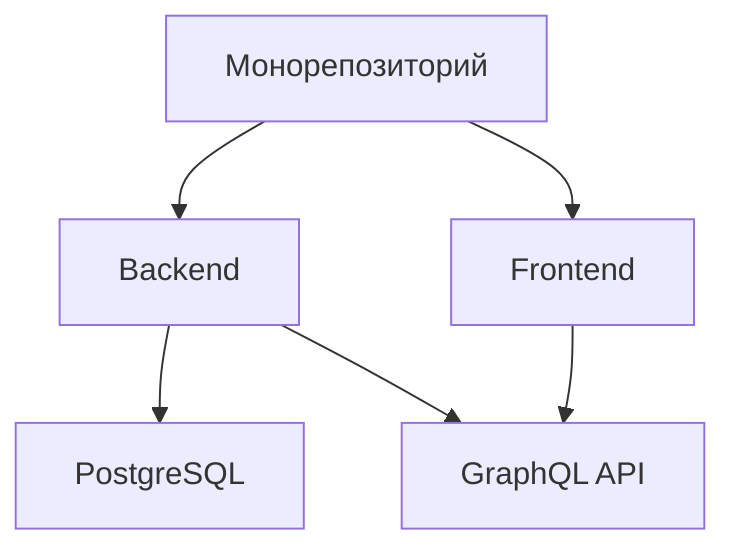
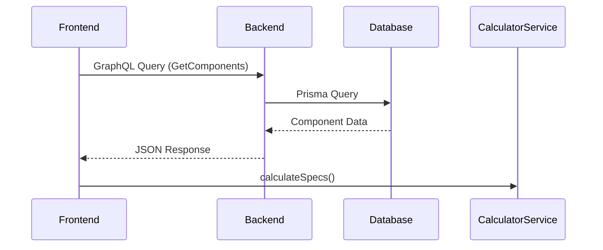

```markdown
# Описание проекта «LED Calculator»

## Обзор
**LED Calculator** — full-stack веб-приложение для расчета характеристик и стоимости светодиодных экранов.  
**Цель**: Инструмент для менеджеров и инженеров с возможностью:
- Конфигурации LED-экранов по индивидуальным параметрам
- Генерации технических спецификаций
- Автоматического расчета стоимости

## Стек технологий
### Бэкенд
| Компонент       | Технологии                         |
|-----------------|------------------------------------|
| Язык            | TypeScript (Node.js)               |
| Фреймворк       | Express.js                         |
| База данных     | PostgreSQL + Prisma ORM            |
| API             | GraphQL (Apollo Server + Pothos)   |
| Аутентификация  | JWT                                |
| Безопасность    | helmet, cors                       |

### Фронтенд
| Компонент          | Технологии                    |
|--------------------|-------------------------------|
| Язык               | TypeScript                    |
| Фреймворк          | React (Vite)                  |
| UI-библиотека      | Mantine UI                    |
| State Management   | Context API + TanStack Query  |
| GraphQL-клиент     | graphql-request               |
| Роутинг            | react-router-dom              |

### Инфраструктура


## Структура проекта
### Бэкенд (`/backend`)
```
backend/
├── prisma/
│   ├── schema.prisma       # Модели БД
│   └── migrations/        # SQL-миграции
├── src/
│   ├── graphql/           # Схемы GraphQL
│   ├── lib/prisma.ts      # Prisma Client
│   └── server.ts          # Точка входа
└── seed/                  # Скрипты наполнения БД
```

### Фронтенд (`/frontend`)
```
frontend/
├── src/
│   ├── components/        # UI-компоненты
│   │   └── inputs/        # Поля формы
│   ├── context/           # React Contexts
│   ├── generated/         # GraphQL типы
│   └── pages/             # Страницы приложения
└── vite.config.ts         # Конфиг сборки
```

## Ключевые функции
1. **Динамический калькулятор**:
   - Расчет технических параметров (разрешение, энергопотребление)
   - Формирование спецификаций компонентов
   - Автоматический расчет стоимости

2. **Особенности реализации**:
   ```tsx
   // Пример компонента формы
   <CalculatorForm>
     <PitchSelect options={pitchOptions} />
     <DimensionInputs onChange={updateSpecs} />
   </CalculatorForm>
   ```

3. **Рабочий процесс**:
   1. Пользователь выбирает параметры
   2. Система фильтрует доступные опции
   3. GraphQL-запросы к бэкенду
   4. Расчет результатов на фронтенде

## Текущий статус
✅ **Завершено**:
- Базовая функциональность калькулятора
- Интеграция Prisma + GraphQL
- Система аутентификации

🛠 **В процессе**:
- Рефакторинг CalculatorContext
- Оптимизация хуков useMemo/useCallback
- Декомпозиция бизнес-логики

## Планы развития
- [ ] Экспорт результатов в PDF
- [ ] Интеграция с CRM (Bitrix24)
- [ ] Система сохранения конфигураций
- [ ] Расширенная валидация форм

## Заключение
Проект представляет собой современное решение с:
- Типобезопасным стеком (TypeScript + GraphQL)
- Гибкой архитектурой
- Потенциалом для масштабирования

> **Для новых разработчиков**: Полная документация по запуску доступна в `CONTRIBUTING.md`
```

### Дополнительные возможности:
1. Для визуализации сложных связей можно добавить диаграмму последовательности:


2. Таблицу сравнения технологий:
| Критерий          | Prisma       | TypeORM      |
|-------------------|--------------|--------------|
| Поддержка TS      | ✅ Нативно  | ✅           |
| Миграции          | ✅ Авто     | ✅ Ручные    |
| Производительность| ⚡️ Высокая  | 🐢 Средняя   |